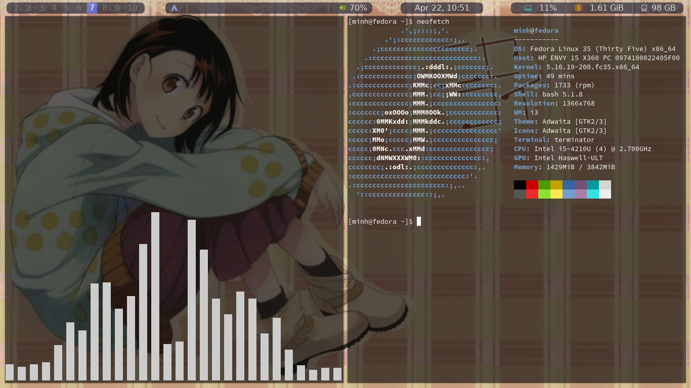
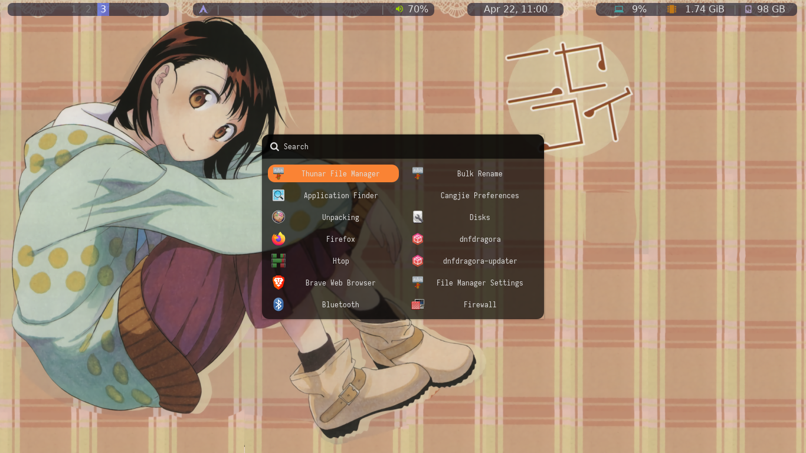
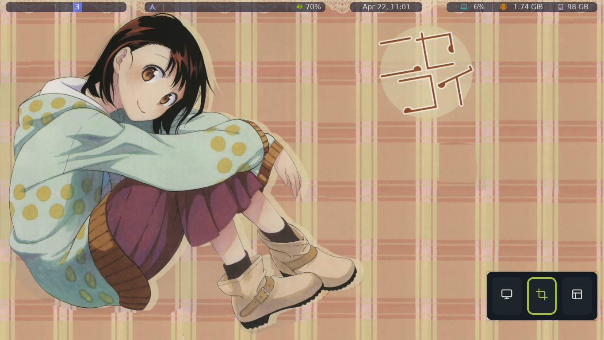
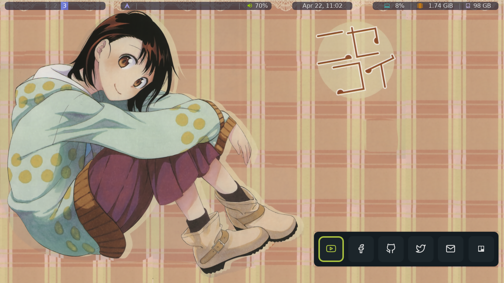
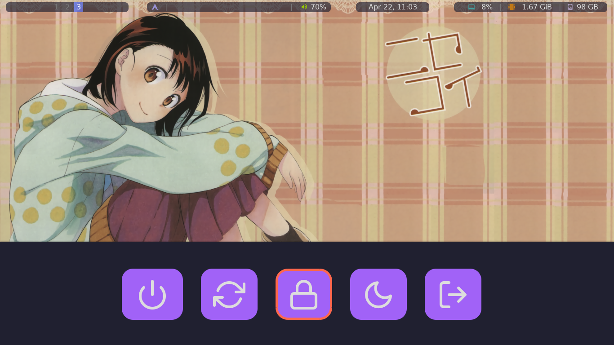

# dot-files

## Dependencies

### Everythings
```sh
sudo dnf remove compton
sudo dnf install xautolock rofi polybar picom viewnior scrot terminator
```

#### i3-gaps
```sh
dnf remove i3
dnf copr enable fuhrmann/i3-gaps
dnf install i3-gaps
```

#### Brave
```sh
sudo dnf install dnf-plugins-core

sudo dnf config-manager --add-repo https://brave-browser-rpm-release.s3.brave.com/x86_64/

sudo rpm --import https://brave-browser-rpm-release.s3.brave.com/brave-core.asc

sudo dnf install brave-browser
```

## ScreenShot


### Launcher


### ScreenShot Tool


### Quick links


### Powermenu


## Rofi Inspirator
Author of those styles: Aditya Shakya
Author github [page](https://github.com/adi1090x/rofi)

Even through I need to fix a lot of ___bugs___ in styles. But without they I don't even know how to config all of that.

## Why there is Arch logo ?
Well it is my network signal. I can't find any good looking wifi bar so I decide to use the speed and my favorite browsers. But I can't find brave icon so linux distro fix that. Some time it confused but ! I use Arch btw.

__Fact:__ I put Internet explorer at the less wifi bar.

## Team Onodera hurray
