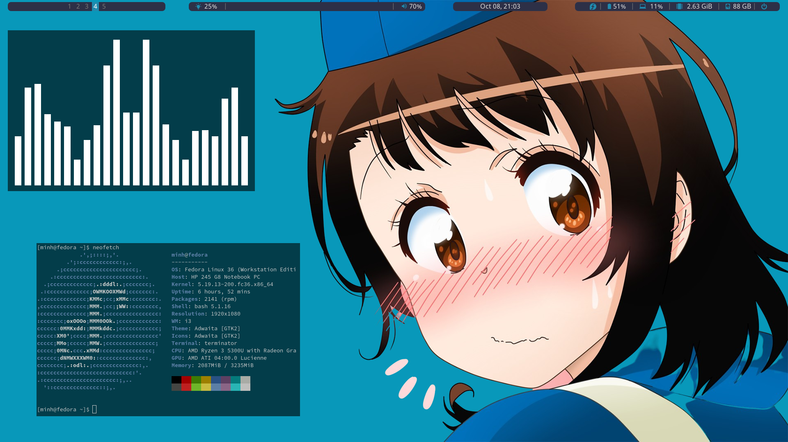
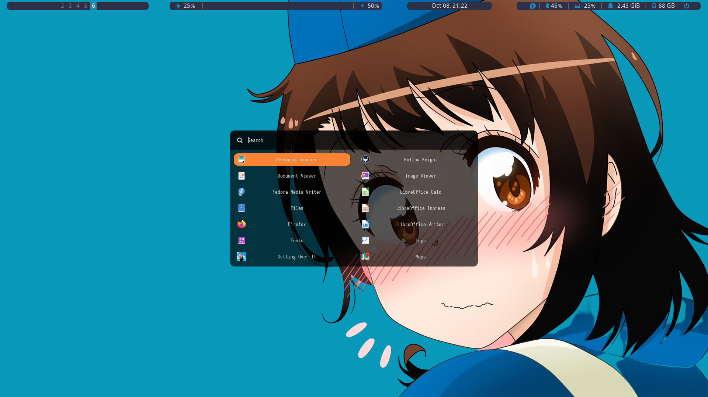
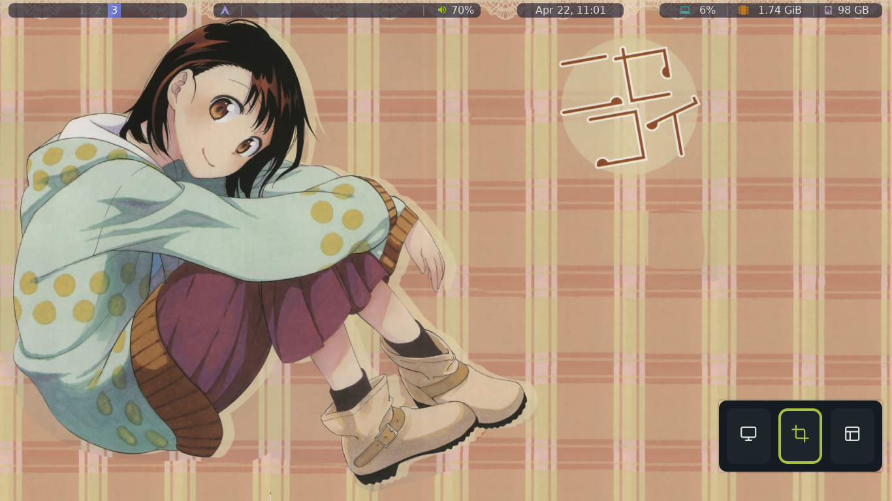
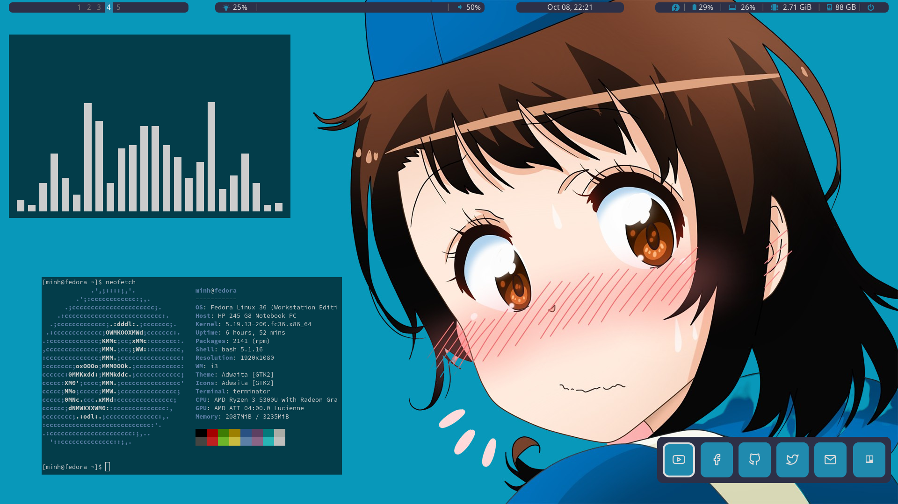
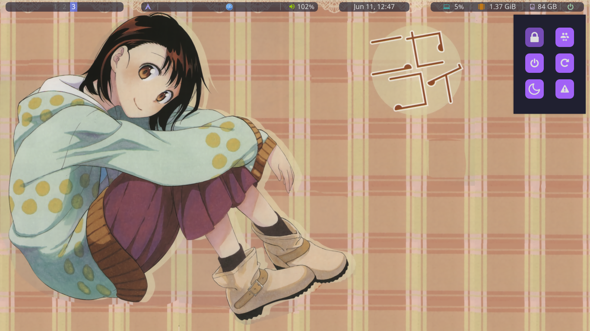

# dot-files

## Dependencies

### Required
```sh
sudo dnf install scrot terminator nodejs light alsa-plugins-pulseaudio pavucontrol thunar btop gedit
```

#### Awesome WM
```sh
sudo dnf install awesome rofi picom xset xss-lock polkit-gnome
```

#### Betterlockscreen
Other dependencies should be manually install
```sh
sudo dnf copr enable tokariew/i3lock-color
sudo dnf install i3lock-color ImageMagick xrandr xrdb xdpyinfo feh -y
wget https://raw.githubusercontent.com/betterlockscreen/betterlockscreen/main/install.sh -O - -q | sudo bash -s system

# Adding image to betterlockscreen cache
betterlockscreen -u ~/.config/awesome/Onodera.jpg
```

#### GoogleDrive
```sh
sudo dnf install rclone rclone-browser
```

#### Flatpak
```sh
flatpak remote-add --if-not-exists flathub https://flathub.org/repo/flathub.flatpakrepo
```
#### Font manager
```sh
flatpak install flathub org.gnome.FontManager
```

#### unikey, LXAppearance, Icon theme , Image Viewer
```sh
sudo dnf install ibus-unikey lxappearance papirus-icon-theme ristretto feh
```

## ScreenShot


### Launcher


### ScreenShot Tool


### Quick links


### Powermenu


## Rofi Inspirator
Author of those styles: Aditya Shakya
Author github [page](https://github.com/adi1090x/rofi)

Even through I need to fix a lot of ___bugs___ in styles. But without they I don't even know how to config all of that.

## Awesome widget greatest Hero
Author of most widget: Pavel Makhov
Github [page](https://github.com/streetturtle/awesome-wm-widgets) of widget cpu, brightness, sound, logout menu

Also a really cool [website](http://pavelmakhov.com/awesome-wm-widgets/) for more widget

## Team Onodera hurray
